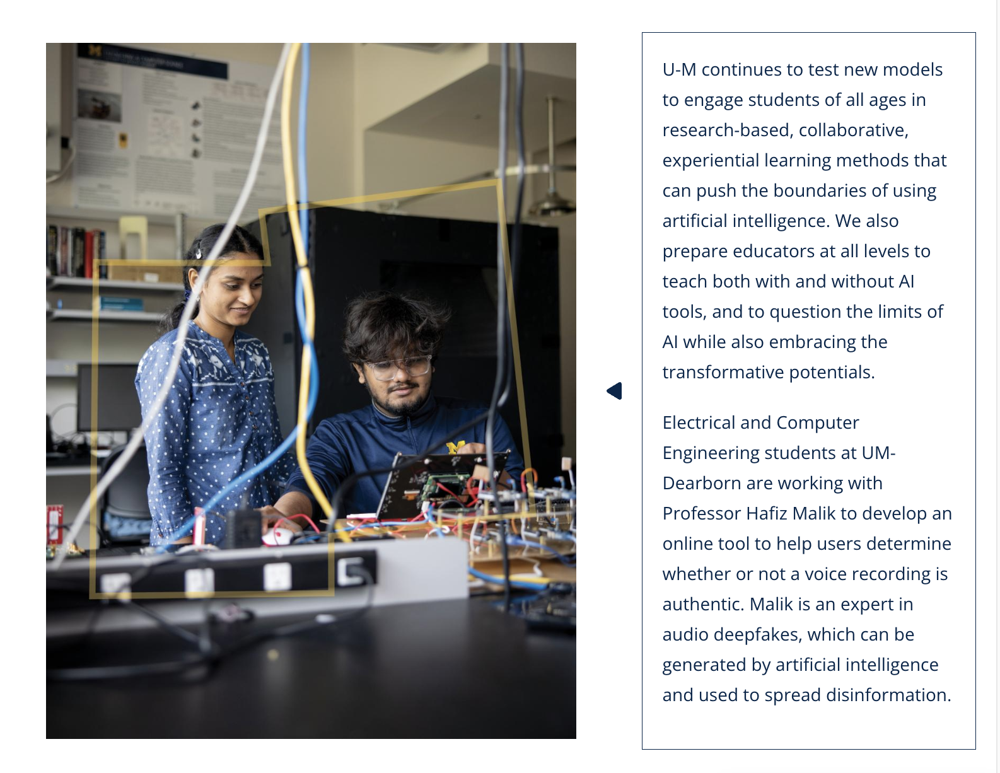
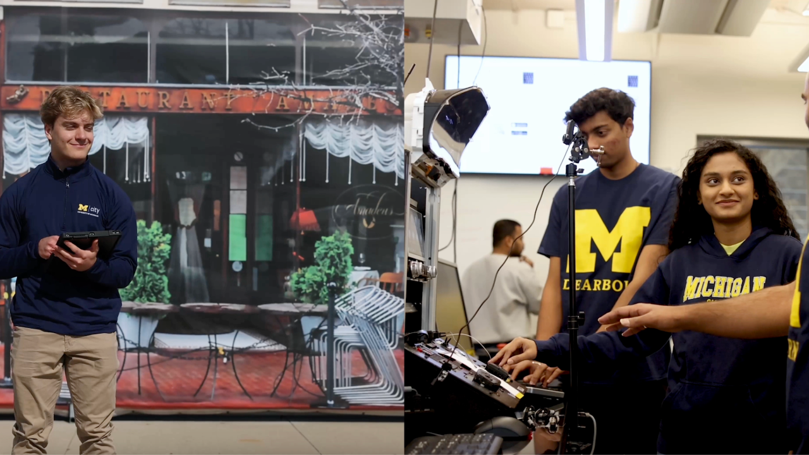

# 🔊 Robust Audio Deepfake Detection under Laundering Attacks

Spectrogram analysis helps detect deepfakes by visualizing frequency anomalies in audio and video signals. It can be used with machine learning models to identify synthetic patterns that are not naturally occurring. Ongoing research focuses on improving detection accuracy and efficiency, especially against evolving deepfake techniques.

---

## 📚 Table of Contents

1. [Overview](#overview)
2. [Key Features](#key-features)
3. [Architecture](#architecture)
   - [Data Flow](#data-flow)
   - [Pipeline Components](#pipeline-components)
4. [Project Structure](#project-structure)
5. [Quick Start](#quick-start)
6. [Usage Examples](#usage-examples)
7. [Configuration](#configuration)
8. [Evaluation & Metrics](#evaluation--metrics)
9. [Development Setup](#development-setup)
10. [Roadmap](#roadmap)
11. [Resources](#resources)
12. [License](#license)

---

## 📌 Overview

This project benchmarks deepfake detection systems using audio that has been deliberately distorted through various post-processing attacks. It evaluates models on **spectrogram-transformed audio data** and emphasizes resilience under real-world distortions.

---

## 🚀 Key Features

- 🎧 Supports audio deepfake detection only (not video)
- 📁 Trained on ASVSpoof 2019 and curated public figures dataset
- 🧪 Evaluated under 5 major laundering categories
- 🔍 Generates visual plots and performance metrics
- 🧠 Model: CNN-based architecture

---
## ISSF Lab : https://issf.umd.umich.edu/home 

⸻

⚡ Quick Start

git clone [https://github.com/AishwaryaDekhane/deepfake-audio-detector.git](https://github.com/AishwaryaDekhane/DeepFake-Detection/tree/main)
cd deepfake-audio-detector
pip install -r requirements.txt
python scripts/train.py

⸻

🧪 Usage Examples

# Convert audio to spectrograms
python scripts/generate_spectrograms.py --input data/raw_audio --output data/spectrograms

# Apply laundering transformations
python scripts/preprocess_laundering.py --input data/raw_audio --output data/laundered

# Train model
python scripts/train.py

# Evaluate model
python scripts/evaluate_models.py

# Visualize results
python scripts/visualize_results.py

⸻

⚙️ Configuration

Edit config.yaml to customize model or data parameters:

data_dir: data/spectrograms
model:
  name: Model
  epochs: 50
  lr: 0.0005
  batch_size: 32
save_path: models/saved_model.pth

⸻

📈 Evaluation & Metrics

Replace this with your result tables or plot visuals

	•	Metric 1: Equal Error Rate (EER)
	•	Metric 2: Area Under Curve (AUC)
	•	Tested On:
	•	Reverberation (RT60: 0.3, 0.6, 0.9)
	•	Noise (Babble, White, Street, Cafe, Volvo)
	•	Resampling (8k, 11k, 22k, 44k)
	•	Recompression (16k, 64k … 320k)
	•	Low-Pass Filtering (Butterworth 7kHz)

⸻

🧑‍💻 Development Setup
	•	Python: >=3.8
	•	Recommended:
	•	torch
	•	librosa
	•	audiomentations
	•	pyroomacoustics
	•	opencv-python

pip install -r requirements.txt

⸻

🛣️ Roadmap
	•	Deepfake classifier
	•	Full laundering attack simulations
	•	Real-time deepfake detection (stream-based)
	•	Web dashboard integration (Streamlit or Flask)
	•	Extend to multi-modal (audio + video)

